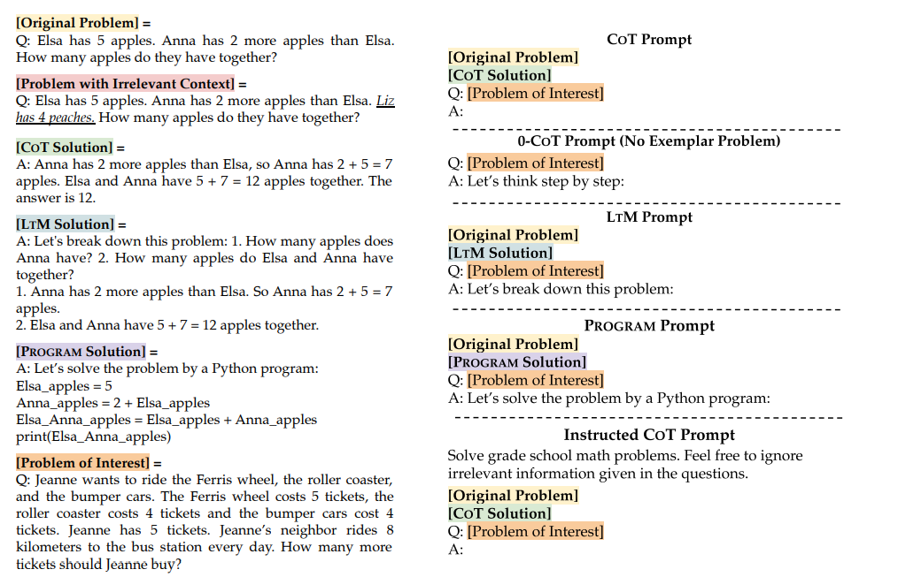

# PaperList
papers about prompt engineering.

if you want to recommend/pr paper,please **read** and **understand** it, **summarize** wit the problem and the solution/insight.

# List

[Large Language Models Can Be Easily Distracted by Irrelevant Context](https://arxiv.org/pdf/2302.00093.pdf)

#### 问题/现象
如果prompt里的信息有与当前问题不相关的，则模型最终的效果很容易受到干扰而性能降低。
#### 解决方案
作者提出这个情况下，可以在prompt 里加一句“feel free to ignore irrelevant information ",可以有效缓解无关信息的干扰。

- - - 